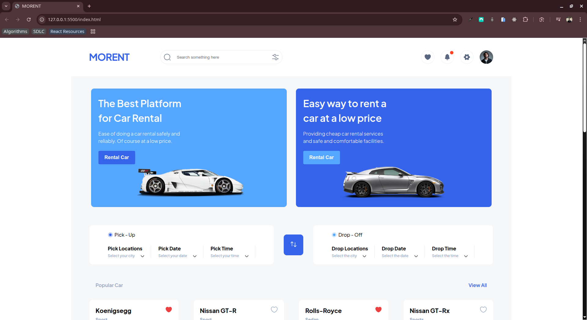

# MORENT | A CAR RENTAL PLATFORM

## App

## Project Overview

Your task is to replicate the given Figma design as closely as possible using only HTML and CSS (no JavaScript required unless otherwise instructed). This project is designed to help you develop pixel-perfect UI building skills and understand layout structuring, spacing, typography, and responsive design principles.

🔗 Figma File
https://www.figma.com/design/PB6gdHlUaagtwNG5MgDR5g/Car-Rent-Website-Design---Pickolab-Studio--Community-?node-id=1-5&p=f&t=4WPoA5Em61GpM237-0

Requirements
1. HTML Structure
Use semantic HTML5 tags (header, main, footer, section, article, etc.)
Structure your HTML to match the layout and flow of the Figma design
Include meaningful alt text for all images
2. CSS Styling
Replicate font sizes, colors, spacing, margins, paddings, and layout structure as seen in the design
Use Flexbox and/or CSS Grid for layout
No frameworks (e.g., Bootstrap or Tailwind) — only raw CSS
Use custom properties (--main-color) where appropriate for better theming
You may use a CSS reset or normalize.css if needed
3. Assets
Export images and icons from Figma (PNG/SVG)
Store all assets in an /assets or /images folder
Reference them correctly in your HTML
4. Typography
Use Google Fonts if custom fonts are used in the design
Match font weights, line height, and letter spacing as closely as possible
5. Responsiveness
Ensure the design works on mobile, tablet, and desktop
Use media queries to adjust layout accordingly
Aim for a mobile-first approach
6. File Organization
Keep your project organized:
/index.html
/styles/style.css
/images or /assets
Use consistent and readable naming conventions

## Clone Project

- To get a local copy up and running follow these simple example steps.
- Clone this repository with `git@github.com:Chu29/car-rental-website.git` using your terminal or command line.
- Change to the project directory by entering: `cd car-rental-website` in the terminal.

## Command line steps

- $ git clone `git@github.com:Chu29/car-rental-website.git`
- $ `cd car-rental-website`
- $ `git checkout feature/html-css-0.0.2`

## Live Site

[MORENT | A CAR RENTAL PLATFORM ](https://chu29.github.io/car-rental-website/)

## Author

**Chu Abuemkeze M.K**

- GitHub: [@Chu29](https://github.com/Chu29)
- Twitter: [@chu_codes](https://x.com/chu_codes)
- LinkedIn: [Chu Abuemkeze M.K](https://www.linkedin.com/in/chu-abuemkeze/)
